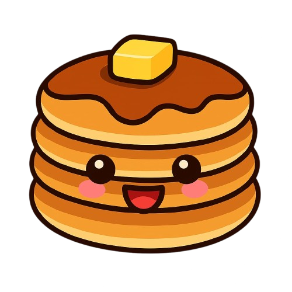

<div align="center">
  
</div>

<div align="center">
   <p style="margin:0; font-size:4em;">Puncake</p>
   <p style="margin:0; font-size:1.5em; font-weight:normal;margin-bottom:2em">A key-value store based on Redis</p>
</div>

## Why puncake ???
- I think giving a name and a face is better than just "redis-clone" or something like that.
- Bun + pancake
- Redis is a group of "plates" stacked upon each other, i wanted some food that can also be stacked to represent my implementation
- It is also a pun!

## Requirements
- bun 1.2.5

## How to run

### Install dependencies
```
$ bun install
```

### Run project
```
$ bun app/main.ts
```

## How to interact
The application is a socket, you can interact with in many ways

### Send commands via nc
Redis uses a protocol called [Redis serialization protocol (RESP)](https://redis.io/docs/latest/develop/reference/protocol-spec/)

```
printf '*2\r\n$4\r\nECHO\r\n$3\r\nhey\r\n' | nc localhost <PORT>
```

### Using redis-cli
You can also uses [Redis CLI](https://redis.io/docs/latest/develop/tools/cli/) for a more user-friendly interaction
```
redis-cli ECHO hey
```

Based on [Codecrafters Redis challenge](https://app.codecrafters.io/courses/redis)